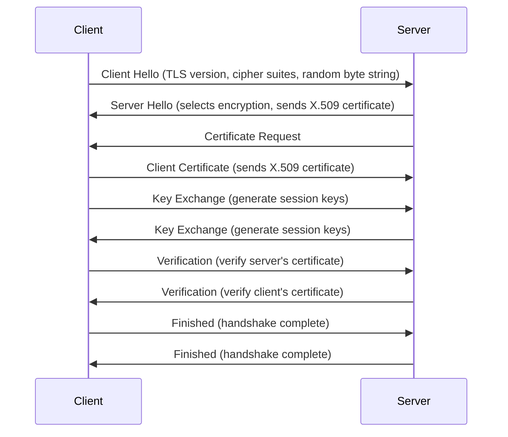

### In-Depth: Understanding the Technical Foundations of mTLS

Mutual Transport Layer Security (mTLS) is a security protocol that extends TLS 
(Transport Layer Security) by requiring both the client and the server to 
authenticate themselves to each other before any data is exchanged. This mutual 
authentication ensures a higher level of security, making mTLS an excellent 
choice for protecting sensitive transactions and data transfers. Here's a 
closer look at the key technical components and processes involved:

#### X.509 Certificates: The Digital Passports

X.509 certificates are at the heart of the mTLS authentication process. Think 
of these certificates as digital passports or ID cards. Each certificate 
contains the identity of the certificate holder and is signed by a trusted 
certificate authority (CA). This signature verifies the certificate's 
authenticity, ensuring that the holder is who they claim to be.

Certificates include public keys which are used for encryption and digital 
signatures. The corresponding private keys, which are kept secret, are used to 
decrypt data or sign digital documents, proving the holder's identity.

#### The mTLS Handshake: A Step-by-Step Process

The mTLS handshake is a series of steps that take place before data 
transmission starts, ensuring that both parties are authenticated:

#### Encryption and Secure Communication

Once the handshake is complete, all transmitted data is encrypted using the 
session keys established during the handshake. This ensures that even if data 
is intercepted, it cannot be deciphered by unauthorized parties.

The strength of mTLS lies in its dual verification process. Not only must the 
server prove its identity to the client (as in traditional TLS), but the client 
must also authenticate itself to the server. This bidirectional authentication 
makes mTLS particularly suited for environments where trust and security are 
paramount, such as financial services, healthcare, and secure corporate 
communications.

#### Key Takeaways

- **X.509 Certificates**: Serve as digital IDs, enabling entities to prove 
  their identity securely.

- **Mutual Authentication**: Both client and server must prove their identities 
  to each other, significantly enhancing security.

- **Encrypted Communication**: Following a successful handshake, all data is 
  encrypted, safeguarding against eavesdropping and tampering.

Understanding these technical foundations of mTLS illuminates why it stands out 
as a superior method for securing digital communications, offering robust 
protection against a wide range of cyber threats.
